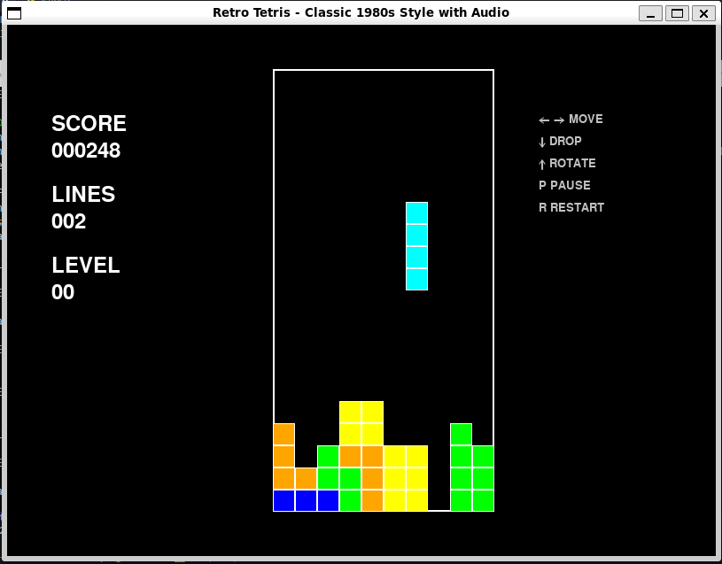

# 🎮 Retro Tetris

A faithful recreation of the classic Tetris game with authentic 1980s arcade styling, complete with background music and sound effects.




## 🚀 Quick Start

```bash
# Clone the repository
git clone https://github.com/yourusername/retro-tetris.git
cd retro-tetris

# Install dependencies
pip install pygame

# Run the game
python retro_tetris_main.py
```

## 🎮 Features

### 🎨 Authentic 1980s Style
- **Classic color palette** with bright colors on dark background
- **Retro typography** with pixelated, arcade-style fonts
- **Smooth 60 FPS gameplay** with fluid animations
- **Progressive difficulty** that increases with level

### 🎵 Universal Audio System
- **Background music** with classic Tetris-style melody
- **Sound effects** for line clears, pause, and game over
- **Cross-platform compatibility** - works on Windows, Mac, and Linux
- **Automatic fallbacks** - gracefully handles audio issues
- **Lower-pitched tones** for comfortable listening

### 🎯 Classic Gameplay
- **7 Tetris pieces** (I, O, T, S, Z, J, L shapes)
- **Line clearing** with visual effects
- **Score system** with level progression
- **Pause functionality** with enhanced display
- **Game over detection** and restart capability

## 🎮 Controls

| Key | Action |
|-----|--------|
| `←` `→` | Move piece left/right |
| `↓` | Soft drop (faster fall) |
| `↑` | Rotate piece |
| `P` | Pause/Resume game |
| `R` | Restart (when game over) |
| `ESC` | Quit game |

## 🏆 Scoring

- **Single line:** 100 × level
- **Double lines:** 300 × level  
- **Triple lines:** 500 × level
- **Tetris (4 lines):** 800 × level

## 🔧 System Requirements

- **Python:** 3.6 or higher
- **Pygame:** 2.0 or higher
- **Operating System:** Windows, macOS, or Linux
- **Memory:** 50MB RAM
- **Storage:** 10MB disk space

## 🛠️ Installation & Setup

### Option 1: Quick Start
```bash
python retro_tetris_main.py
```

### Option 2: With System Check
```bash
# Check system compatibility first
python setup_game.py

# Then run the game
python retro_tetris_main.py
```

## 🎵 Audio Features

The game includes a sophisticated audio system that:

- **Automatically detects** the best audio method for your system
- **Provides multiple fallbacks** (pygame audio → system beeps → visual feedback)
- **Uses comfortable frequencies** (lower-pitched for easy listening)
- **Works universally** across different operating systems and configurations

### Audio Methods
1. **Pygame Audio** - Primary method with generated music
2. **System Beeps** - Windows winsound fallback
3. **Visual Feedback** - Always-working fallback with text notifications

## 📁 Project Structure

```
retro-tetris/
├── retro_tetris_main.py      # Main game launcher
├── setup_game.py             # System compatibility checker
├── README.md                 # This file
├── requirements.txt          # Python dependencies
├── .gitignore               # Git ignore rules
└── tetris/                  # Game package
    ├── __init__.py          # Package initialization
    ├── constants.py         # Game constants and colors
    ├── retro_tetris.py      # Main game engine
    └── universal_audio.py   # Cross-platform audio system
```

## 🔧 Troubleshooting

### No Audio
The game automatically falls back to visual feedback if audio doesn't work. To troubleshoot:
- Check system volume
- Run `python setup_game.py` for diagnostics
- Audio issues don't affect gameplay

### Performance Issues
- Close other applications
- Game is optimized for 60 FPS on most systems

### Controls Not Working
- Ensure game window has focus (click on it)
- All standard arrow keys are supported

## 🎯 Game Tips

- **Plan ahead** using the next piece preview
- **Create combos** by clearing multiple lines at once
- **Use rotation** to find better piece placements
- **Don't rush** - take time to find optimal positions

## 🤝 Contributing

Contributions are welcome! Please feel free to submit a Pull Request.

## 📄 License

This project is licensed under the MIT License - see the [LICENSE](LICENSE) file for details.

## 🎮 Credits

- **Original Tetris:** Created by Alexey Pajitnov
- **Music:** Inspired by Korobeiniki (traditional Russian folk song)
- **Implementation:** Modern Python/Pygame recreation

---

**Enjoy the classic Tetris experience! 🎮🎵**